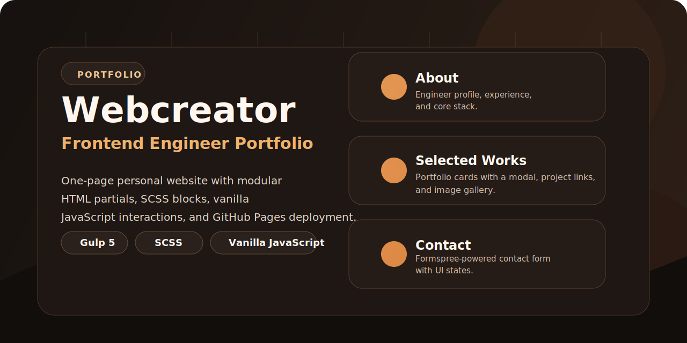

# Webcreator

<p align="center">
  <a href="https://volkov85.github.io/webcreator/">
    
  </a>
</p>

<p align="center">
  <a href="https://volkov85.github.io/webcreator/">
    
  </a>
  <a href="https://github.com/volkov85/webcreator/actions/workflows/deploy-pages.yml">
    
  </a>
  
  
  
</p>

A personal portfolio website for frontend engineer Artyom Volkov. This repository contains the source code for a one-page site with `About`, `Selected Works`, `Certificates & Learning`, and `Contact` sections, built with `Gulp`, `SCSS`, and vanilla `JavaScript`.

## Overview

- static site build without a frontend framework;
- HTML pages composed from partials via `posthtml-include`;
- SCSS architecture split into reusable blocks;
- HTML and CSS minification during build;
- local development server powered by `BrowserSync`;
- client-side interactions: mobile menu, smooth scroll, portfolio modal, contact form submission, deferred `particles.js` loading;
- automatic deployment to GitHub Pages via GitHub Actions.

## Stack

- `Node.js >= 22`
- `Gulp 5`
- `Sass`
- `PostCSS + Autoprefixer`
- `BrowserSync`
- `HTMLMin`, `CSSO`
- `Stylelint`
- `EditorConfig CLI`

## Project Structure

```text
.
├─ source/
│  ├─ index.html                  # entry point
│  ├─ partials/index/             # page sections and shared HTML fragments
│  ├─ sass/                       # global styles and block-level SCSS
│  ├─ js/                         # client-side scripts
│  ├─ img/                        # images and portfolio previews
│  └─ fonts/                      # local fonts
├─ build/                         # production build output
├─ .github/workflows/             # CI/CD for GitHub Pages
├─ gulpfile.js                    # build pipeline
└─ package.json                   # npm scripts and dependencies
```

## Quick Start

```bash
npm install
npm start
```

After running `gulp start`:

- a full build is generated in `build/`;
- a local `BrowserSync` server is started;
- changes inside `source/` are automatically rebuilt and reloaded.

## Main Commands

```bash
npm start      # local development
npm run build  # production build into build/
npm run test   # editorconfig + stylelint
```

Additional gulp tasks are available:

```bash
npx gulp images  # optimize png/jpg/svg in source/img
npx gulp webp    # generate .webp from png/jpg
npx gulp clean   # clean build/
```

## Build Pipeline

`gulp build` performs the following steps:

1. cleans the `build/` directory;
2. copies fonts, images, and the `favicon`;
3. compiles `source/sass/style.scss` into `build/css/style.min.css`;
4. builds `source/*.html` with include files from `source/partials/`;
5. copies client-side scripts into `build/js`.

## Deployment

Automatic publishing is configured in [`.github/workflows/deploy-pages.yml`](.github/workflows/deploy-pages.yml).

- the workflow runs on every push to the `master` branch;
- it uses `Node.js 22`;
- the published artifact is the `build/` directory;
- the site is deployed through GitHub Pages.

## Contact Form

The form in [`source/partials/index/contact.html`](source/partials/index/contact.html) submits data through `Formspree`. If you want to use a different endpoint, replace the form `action` value. The submission logic and success/error states are implemented in [`source/js/script.js`](source/js/script.js).

## Verification

At the time this README was updated, the following commands passed locally:

- `npm run test`
- `npm run build`
